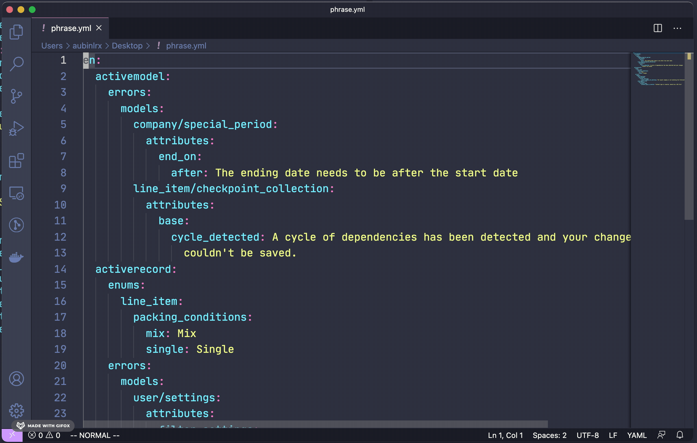

# YAMLNav

YAMLNav is an VSCode extension that let you search through yaml file by path and copy the yaml path
under the cursor.
## Features

**Search**

Find a specific location by searching the entire path.

**Copy**

Copy the path under the cursor.

